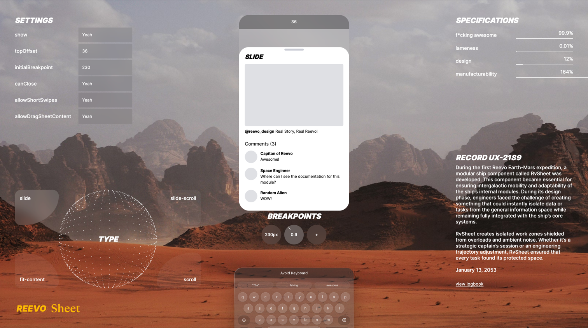
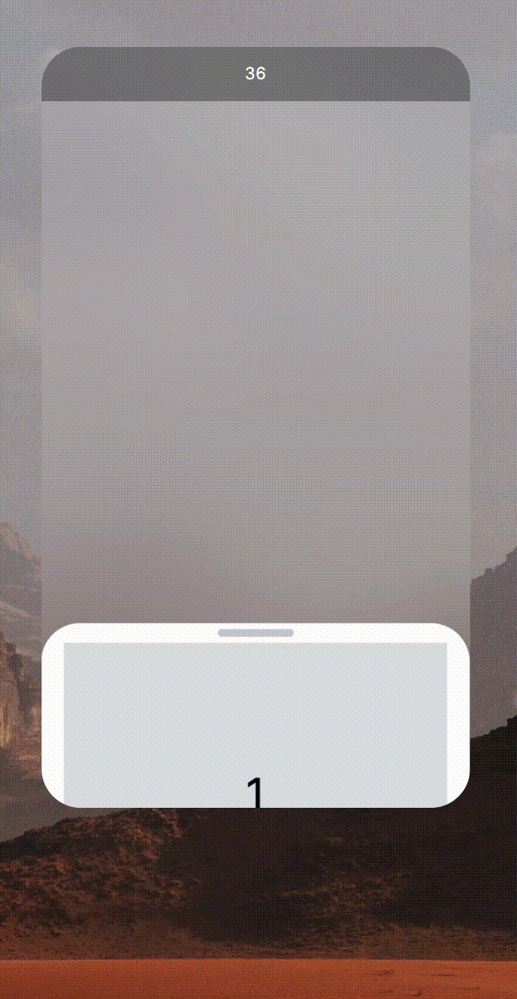
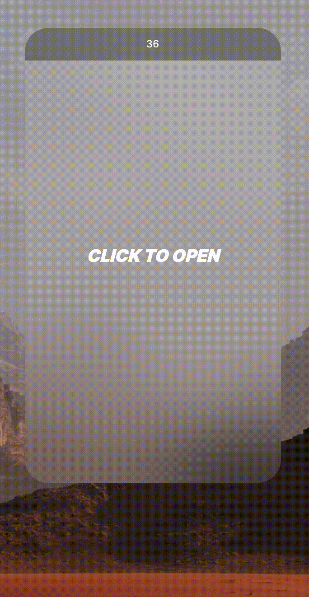

# Reevo Sheet | Modern touch-friendly modal built with pure js

  <strong>Reevo Sheet</strong> is a modern and highly customizable modal component designed for touch devices, utilizing <a href="https://developer.mozilla.org/en-US/docs/Web/API/Web_Animations_API" target="_blank">WAAPI</a> and pure JavaScript.

  
  
  
  

  <strong>Real Reevo, Real Story!</strong>

## 🚀 Features
- **Touch-Optimized**: Designed specifically for mobile and touch devices, RvSheet ensures smooth, user-friendly interactions for all users.
- **Smooth Animations**: Powered by WAAPI, offering one of the most efficient and smooth animation experiences available today.
- **Framework-Agnostic**: Built with pure JavaScript, RvSheet seamlessly integrates with any framework of your choice, from React to Angular, Vue, or even vanilla JS.
- **Highly Customizable**: Packed with all the essential props to meet your customization needs.
- **Full Control**: Offers complete flexibility over templates and styles, empowering you to create a fully customized user experience.
- **Virtual keyboard avoidance**: Automatically adjusts and moves the sheet when the virtual keyboard opens on mobile devices, providing an uninterrupted user experience.
- **Lightweight and Efficient**: At just 20KB, RvSheet is designed for speed and performance without compromising on functionality.

## 🛝 Playground

Experiment with RvSheet props in real time on our [interactive playground](https://reevo.design/modules/sheet)

## 📄 Documentation

Access the full Reevo Sheet [documentation](https://reevo.design/docs/sheet) to learn about all available features, configurations, and integration tips.

## 📄 API

Dive into the details of RvSheet’s [API](https://reevo.design/docs/sheet/api) to learn about available properties, events, and methods.

## 🪟 Vue.js template

Check out the Vue.js template example for RvSheet:
[View the template here](https://github.com/reevo-design/rv-sheet-vue-template)

### RECORD UX-2189

_During the first Reevo Earth-Mars expedition, a modular ship component called RvSheet was developed. This component became essential for ensuring intergalactic mobility and adaptability of the ship’s internal modules. During its design phase, engineers faced the challenge of creating something that could instantly isolate data or tasks from the general information space while remaining fully integrated with the ship’s core systems._

_RvSheet creates isolated work zones shielded from overloads and ambient noise. Whether it’s a strategic captain’s session or an engineering trajectory adjustment, RvSheet ensured that every task found its protected space._

_January 13, 2053_
